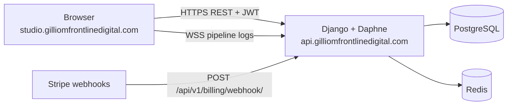

# AI Software Operations Studio — deployment & handoff

Handoff for the Gilliom Frontline Digital production cutover: split web/API domains, Stripe webhook hardening, and operator runbook.

**Last updated:** July 2026  
**Branch:** `codex/studio-foundation`  
**Operator contact:** dallas8000@gmail.com

---

## What shipped in this delivery

| Area | Change |
|------|--------|
| **Split domains** | Web UI at `studio.gilliomfrontlinedigital.com`; API + webhooks at `api.gilliomfrontlinedigital.com` (same Railway web service, two custom domains). |
| **Frontend wiring** | Build-time `VITE_API_BASE` / `VITE_WS_BASE`; WebSocket pipeline logs follow API host. |
| **Catalog / registry** | Hub entry uses `productionUrl` = API, `webProductionUrl` = studio. |
| **Webhook hardening** | Delivery stats from Stripe, live signature probe, auto-repair (rotate secret → vault → Railway). |
| **Monitoring UI** | Webhook health panel with delivery %, probe result, **Auto-repair webhook** button. |
| **Billing webhook** | Falls back to `STRIPE_WEBHOOK_SECRET` when `SAAS_STRIPE_WEBHOOK_SECRET` is empty. |

---

## Architecture (production)



| Host | Purpose |
|------|---------|
| `https://studio.gilliomfrontlinedigital.com` | React SPA (WhiteNoise), login, projects, billing UI |
| `https://api.gilliomfrontlinedigital.com` | REST API, WebSockets, health, Stripe SaaS billing webhook |
| Railway `*.up.railway.app` | Fallback / deploy verification only |

---

## Railway checklist (do before go-live)

### 1. Services

Use the three-service split documented in [deploy/RAILWAY-SERVICES.md](../deploy/RAILWAY-SERVICES.md):

- `operations-studio-web` — Dockerfile build + Daphne
- `operations-studio-worker` — Celery
- `operations-studio-beat` — scheduled drift + health tasks

Add **PostgreSQL** and **Redis** plugins to the project.

### 2. Custom domains (web service)

Railway → **operations-studio-web** → Settings → Networking:

| Domain | Notes |
|--------|-------|
| `studio.gilliomfrontlinedigital.com` | Primary UI (already attached) |
| `api.gilliomfrontlinedigital.com` | **Attach to the same web service** — CNAME to Railway |

Both hostnames must resolve to the **same** deploy. Django auto-adds both to `ALLOWED_HOSTS`, CORS, and CSRF when env vars below are set.

### 3. Required variables (`operations-studio-web`)

| Variable | Production value |
|----------|------------------|
| `VAULT_MASTER_KEY` | 64 hex chars — **never rotate** without `rotate_vault_key` |
| `DJANGO_SECRET_KEY` | Random 50+ chars |
| `DJANGO_DEBUG` | `false` |
| `DATABASE_URL` | From PostgreSQL plugin |
| `REDIS_URL` | From Redis plugin |
| `APP_PUBLIC_URL` | `https://studio.gilliomfrontlinedigital.com` |
| `STUDIO_API_URL` | `https://api.gilliomfrontlinedigital.com` |
| `VITE_API_BASE` | `https://api.gilliomfrontlinedigital.com/api/v1` |
| `VITE_WS_BASE` | `wss://api.gilliomfrontlinedigital.com` |
| `SAAS_STRIPE_SECRET_KEY` | Studio billing restricted key |
| `SAAS_STRIPE_WEBHOOK_SECRET` | Signing secret for **api** billing webhook URL |
| `SAAS_STRIPE_PRICE_*` | Plan price IDs |

**Important:** `VITE_*` vars are baked in at **Docker build time**. After changing them, trigger a **full redeploy** (not just restart).

Worker services share `VAULT_MASTER_KEY`, `DATABASE_URL`, `REDIS_URL`, and Stripe keys; they do **not** need `VITE_*`.

### 4. Stripe Dashboard — Studio SaaS billing

Register **one** webhook endpoint (do not use the studio hostname for webhooks):

| Field | Value |
|-------|-------|
| URL | `https://api.gilliomfrontlinedigital.com/api/v1/billing/webhook/` |
| Events | `checkout.session.completed`, `customer.subscription.*`, `invoice.*` (as configured in billing module) |
| Secret | Copy `whsec_…` → Railway `SAAS_STRIPE_WEBHOOK_SECRET` |

Client project webhooks (e.g. EastBridge at `eastbridge.gilliomfrontlinedigital.com/webhooks/stripe/`) are **separate** — stored per-project in the vault as `STRIPE_WEBHOOK_SECRET`.

### 5. Post-deploy verification

```powershell
# Health (API host)
curl https://api.gilliomfrontlinedigital.com/health/

# UI loads and calls API (browser devtools → Network)
# Expect requests to api.gilliomfrontlinedigital.com/api/v1/...

# Webhook repair CLI (from backend with DATABASE_URL)
cd backend
python scripts/run_webhook_auto_repair.py stripe-installer
```

Expected after cutover:

- `expectedWebhookUrl` = `https://api.gilliomfrontlinedigital.com/api/v1/billing/webhook/`
- Signature probe = `ok` (not `invalid_payload` or `unreachable`)
- Stripe Dashboard delivery success rate trending up after redeploy

If probe is `unreachable`: DNS or Railway custom domain for `api.*` not attached yet.

If probe is `invalid_payload`: `SAAS_STRIPE_WEBHOOK_SECRET` mismatch — run **Auto-repair webhook** in Monitoring or the CLI script, then redeploy.

---

## Operator workflows

### A. Client self-service license purchase

1. Client registers at `/register` (or accepts org invite).
2. **Billing** → enter deployment domain → **Subscribe** (Stripe Checkout).
3. Stripe hits `POST /api/v1/billing/webhook/` on the **api** host.
4. Webhook syncs subscription and emails license key.
5. Client adds license env vars to their deployed instance.

The operator does **not** create passwords or accounts in the normal flow.

### B. Agency onboards a client app (recommended demo)

See [DEMO-SCRIPT.md](./DEMO-SCRIPT.md) for a 3–5 minute recording script.

Summary:

1. Login → create **Agency** org.
2. **New project** → Git URL or local path.
3. Unlock vault → store client `STRIPE_*` keys.
4. Set production URL + edit `stripe.config.json` / `deploy.config.json`.
5. **Run full setup** → readiness score.
6. **Monitoring** → webhook health → auto-repair if needed.
7. Optional: **Deploy prep** + GitHub PR.

### C. Webhook auto-repair (when Stripe shows delivery errors)

**In UI:** Project → Monitoring → **Webhook health** → **Auto-repair webhook** (shown when `autoRepairRecommended`).

**CLI:**

```powershell
cd backend
python scripts/run_webhook_auto_repair.py              # all billing projects
python scripts/run_webhook_auto_repair.py stripe-installer
```

Repair actions (safe):

- Re-register Stripe endpoint at catalog URL
- Rotate signing secret → encrypted vault → Railway variable push
- Sync portfolio registry from catalog

After repair, **redeploy** the web service so the container picks up the new `whsec_`.

---

## Local development

| Mode | API base | WebSocket |
|------|----------|-----------|
| Vite dev (`npm run dev`) | `/api/v1` (proxy) | same origin |
| Unified Docker (`npm run docker:prod`) | same origin | same origin |
| Split-domain simulation | `VITE_API_BASE=http://127.0.0.1:8000/api/v1` | `VITE_WS_BASE=ws://127.0.0.1:8000` |

---

## Known gaps / follow-up

| Item | Status |
|------|--------|
| Attach `api.gilliomfrontlinedigital.com` in Railway | Operator action — required for probe + webhooks |
| Redeploy after `VITE_*` + webhook secret changes | Required for frontend API routing and signature validation |
| Hub delivery ~79% success (pre-cutover) | Should improve once api subdomain + secret aligned |
| Screen recording | Use [DEMO-SCRIPT.md](./DEMO-SCRIPT.md) — operator records locally |

---

## Key files (for maintainers)

| Path | Role |
|------|------|
| `backend/apps/stripe_core/portfolio_catalog.py` | Hub URLs, webhook path, catalog |
| `backend/apps/stripe_core/webhook_delivery.py` | Delivery stats + auto-repair |
| `backend/config/settings.py` | `APP_PUBLIC_URL`, `STUDIO_API_URL`, CORS/CSRF |
| `frontend/src/api/client.ts` | `resolveApiBase()`, `wsOrigin()` |
| `Dockerfile` | `ARG VITE_API_BASE`, `VITE_WS_BASE` |
| `backend/scripts/run_webhook_auto_repair.py` | CLI repair entry point |

---

## Support references

- [RAILWAY.md](./RAILWAY.md) — variables, troubleshooting
- [GO-LIVE.md](./GO-LIVE.md) — five-day client onboarding runbook
- [STRIPE-DJANGO.md](./STRIPE-DJANGO.md) — Stripe integration patterns
- [CUTOVER.md](./CUTOVER.md) — migration from legacy automation center
